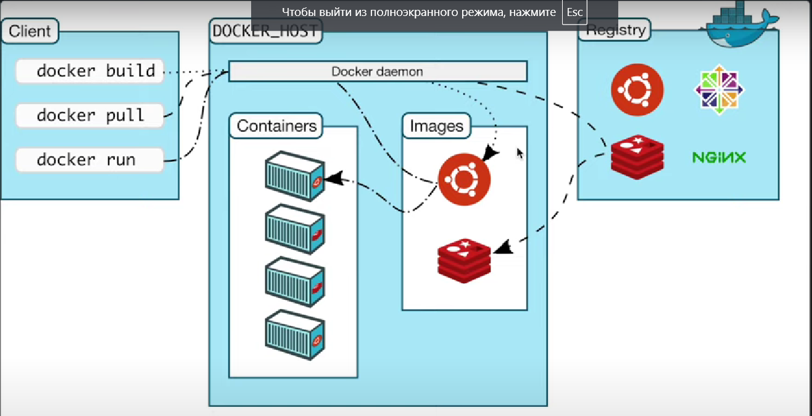
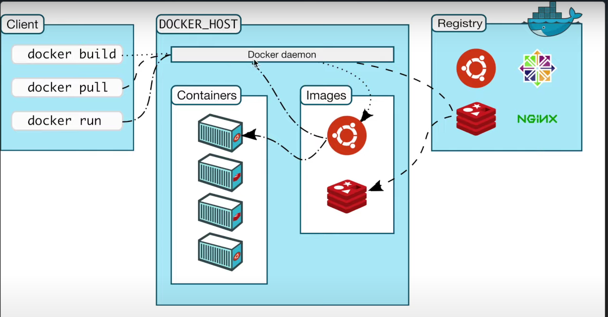
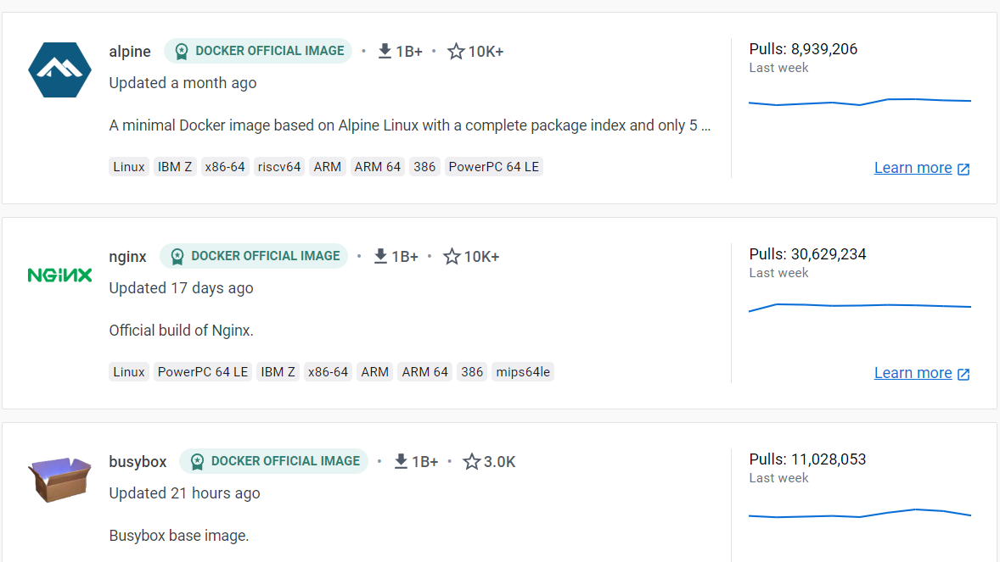
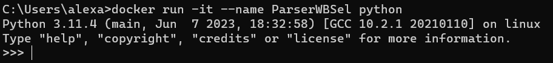
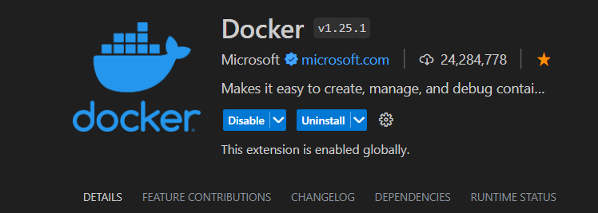
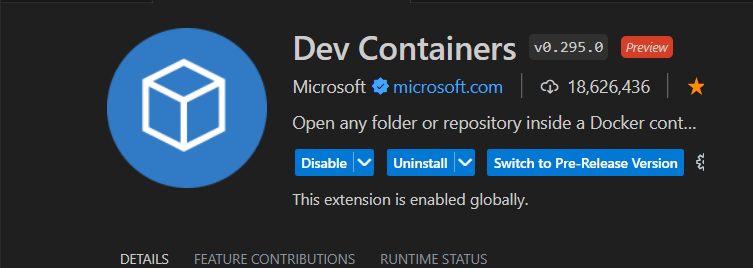
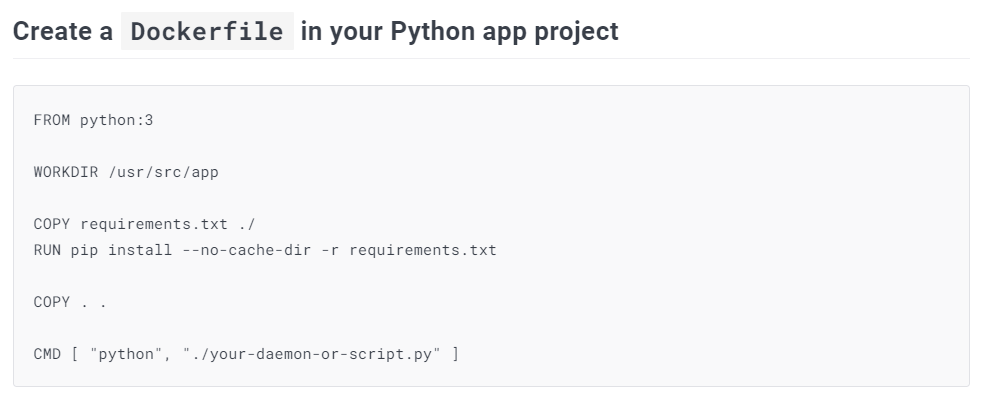

# DOCKER

## Table of content
1. [Команды](#comands)
2. [Теория](#teory)
3. [Установка образа](#install_image)  
3.1. [Команды для linux / ubuntu](#linux_commands)
4. [Работа с VS](#vs_code)
5. [Docker compose](#compose)
6. [Деплой в Docker Hub](#deploy)

## <a name='comands'>1. Команды</a>

Показать список всех команд:
```
docker
```
Запустить контейнер (при его отсутствии скачивает):
```
docker run
```
Скачать контейнер
```
docker pull
```
Посмотреть полную информацию о команде:
```
docker <command> --help
```
Запустить контейнер на заднем фоне:
```
docker run -d
```
Соеденить порты:
```
docker run -p
```
Таким образом, следующая команда запускает контейнер на заднем фоне, связывает порты № 80 локальной и удаленной машины:
```
docker run -d -p 80:80 docker/getting-started
```
Получить информацию о контейнерах и образах:
```
docker info
```
Получить датальную информацию об образах:
```
docker images
```
Получить список доступных контейнеров:
```
docker ps
```
Для открытия информации в браузере нужно ввести в поисковой строке:
```
localhost:80
```
Остановить контейнер:
```
docker stop <id_of_container>
```
Поставить контейнер на паузу:
```
docker pause <id_of_container>
```
Запустить контейнер с паузы:
```
docker unpause <id_of_container>
```
Перезапустить контейнер:
```
docker restart <id_of_container>
```
Залогиниться в терминале:
```
docker login
```
Разлогиниться в терминале:
```
docker logout
```
## <a name='teory'>2. Теория</a>

<b>Образы (images)</b> - готвые решения, которые содержат определенный функционал. Образ нельзя видоизменять, а только скачать из определенной регистра. На основе образа можно создать готовый проект / контейнер.


<b>Образы (images)</b> позволяют без настройки среды разработки запустить проект на локальной машине. То есть за счет образом мы получаем готовый функционал, на котором можно создать свой проект.

Сам проект, содержащий разработанные Вами модули, пакеты - это <b>Контейнер (container)</b>.

<b>Контейнер (container)</b> - упакованный проект, содержащий образы и собственноручный код, позводяющий запускать проекты.

При работе с <b>Docker</b> у нас есть три вещи:


1. <b>Client</b> - выполняет различные команды.
2. <b>DOCKER_HOST</b> - принимает команды и понимает, что хочет клиент.
3. <b>Registry</b> - место, где хрянятся образы.

<b>[dockerhub](https://hub.docker.com/)</b> - место, где хранятся образы <b>docker</b>.

Здесь на вкладе <b>[Explore](https://hub.docker.com/search?q=)</b> представлены различные образы, которые можно использовать для своих проектов.



## <a name='install_image'>3. Установка образа</a>

Для установки образа необходимо выполнить команду:
```
docker pull python
```

По умолчанию устанавливается последняя версия.
Для установки определенной версии образа необходимо выполнить команду:
```
docker pull python:<version>

# пример:
docker pull python:2
```

Запустить образ:
```
docker run <name_image>

# пример:
docker run python
```

При этом запусутить образ без контейнера невозможно.  
При выполнении вышеуказанной команды автоматически создается контейнер.

Посмотреть все контейнеры:
```
docker ps -a
```

Запустить образ в интеравктивном режиме:
```
docker run -it <name_image>

# пример:
docker run -it python
```

При этом несмотря на то, что при предыдщем запуске уже был создан новый контейнер, при новом запуске он будет создан снова, потому что запускаются именно контейнеры, а не образы.

Указать название для контейнера:
```
docker run -it --name <your_name> <name_image>

# пример:
docker run -it --name ParserWBSel python
```

После команды запустить терминал python:


Выйти из терминала:
```
ctrl + D
```

Запустить контейнер:
```
docker start <name_container>

# пример:
docker start ParserWBSel
```

Убить контейнер контейнер (выполнив эту команду Docker максимально жестко выйдет из него, в том числе с ошибками):
```
docker kill <name_container>

# пример:
docker kill ParserWBSel
```

Также в Docker можно скачивать полноценные сервера, в которые в дальнейшем наполнять средами разработки. Обычно серверы работают на <b>linux</b>.  
Скачаем:
```
docker pull ubuntu
```


## <a name='linux_commands'>3.1. Команды для linux / ubuntu</a>

Посмотреть список всех файлов и дерикторий:
```
ls
```

Перейти в дерикторию:
```
cd <name_directory>
```

Создать файл:
```
touch <name_file>

# пример:
touch file.txt
```


## <a name='vs_code'>4. Работа с VS Code</a>

Для работы через VS Code понадобится два расширения:





В директории с проектов необходимо создать файл:
```
Dockerfile
```

Код, который необходимо прописывать в данном файле находится на странице с документацией образа.


```
FROM python

WORKDIR /usr/src/app

COPY requirements.txt ./
RUN pip install --no-cache-dir -r requirements.txt

COPY . .

CMD [ "python", "./your-daemon-or-script.py" ]
```

Данная команда указывает, с какого образа будем брать информацию:
```
FROM python:3
```

Данная команда указывает, какие файлы из нашего проекта мы будем копировать в <b>docker image</b>:
```
COPY requirements.txt ./
```

Поставив точку мы укажем, что необходимо брать и копировать все файлы из текущего директория, где находится <b>Dockerfile</b>:
```
COPY .
```

Далее необходимо указать, в какую папку в нашем образе мы будем все помещать. Данная команда говорит, что все будет помещено в корень образа:
```
COPY ./ 
```

Команда, которая указывает на рабочую директорию:
```
WORKDIR /<name_folder> 
```

Дополнительная команда, которая позволяет отрывать в браузере образ:
```
EXPOSE <port_number>

# example:
EXPOSE 8001
```

Команда, которая которая говорит, что необходимо выполнить при первом запуске (выполняется один раз при создании контейнера):
```
RUN
```

Команда, которая будет выполняться каждый раз при запуске контейнера:
```
CMD [ "<your_intepreter>", "<your_file_or_path>" ]

# пример:
CMD [ "python", "getpage.py" ]
```

Команда, которая позволяет построить образ (в терминал):
```
docker build <path_to_dockerfile>

# пример:
docker build D:\python_projects\ParserWB

# or:
docker build .

# with name of image:
docker build -t my-app .
```

Удалить образ:
```
docker image rm <id_image>

# example:
docker image rm 2344b116fea4
```

Запуск образа с использованием port:
```
docker run -it -p 3001:8001 ac4b4c09bc18
```


## <a name='compose'>5. Docker compose</a>

В файле <b>docker-compose.yml</b> можно указать код для подключения множества образов, в то время как в <b>Dockerfile</b> только один образ.


## <a name='deploy'>6. Деплой в Docker Hub</a>

Создание образа:
```
docker build -t <username>/<imagename> .

example:
docker build -t imartov/parserwbsel .
```

Push образа:
```
docker push <imagename>

example:
docker push imartov/parserwbsel
```


